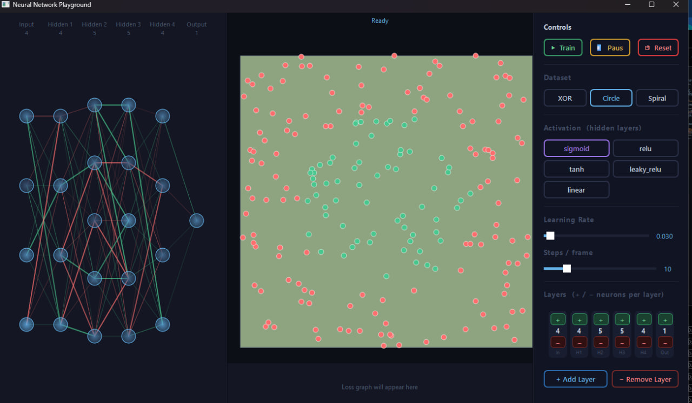
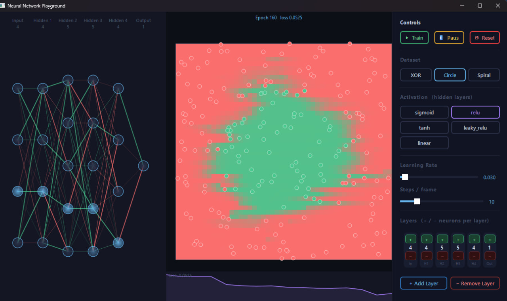
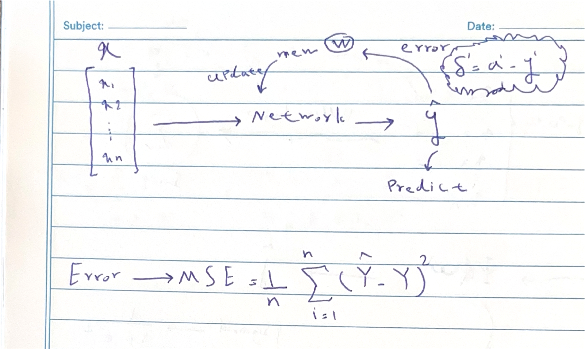
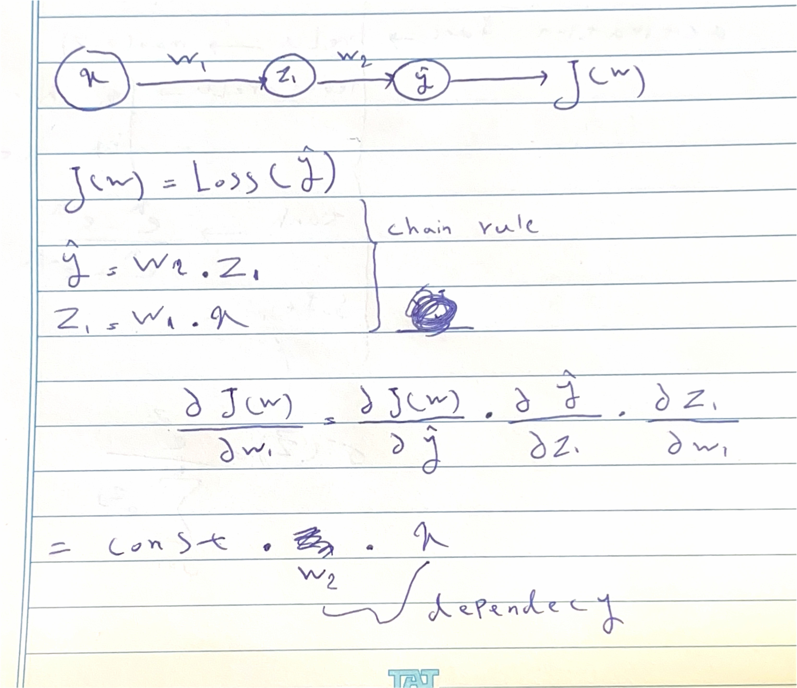

# 🧠 Neural Network From Scratch With Visuals

A fully from-scratch neural network framework built with Python and NumPy and some visualizations.

The purpose of this project is to understand how neural networks work internally by
implementing the core mathematics manually and visualizing the training process.

---

## 🧠 Neural Network Engine

Implemented from scratch:

✅ Custom neurons  
✅ Custom layers  
✅ Weight and bias handling  
✅ Forward propagation  
✅ Backpropagation using chain rule  
✅ Gradient calculation  
✅ Training loop  

---

## 🎛 Interactive Playground

The GUI allows you to experiment with:

| Option | Description |
|-|-|
| Dataset | Change the training problem |
| Activation Function | Test different nonlinear functions |
| Learning Rate | Control gradient descent speed |
| Layers | Add/remove layers |
| Neurons | Increase/decrease neurons |
| Train | Start training |
| Pause | Stop training |
| Reset | Create a new network |

---

# 🖥️ Interface

The application visualizes:

- Network structure
- Neurons
- Connections
- Weights
- Biases
- Live neuron outputs
- Decision boundaries
- Loss curve
- changable data sets




---

# 🚀 Installation

Clone:

```bash
git clone https://github.com/sahandkhodayi/NN-s-from-scratch-with-viuals
cd NN-s-from-scratch-with-viuals
```

Install:
```bash
pip install -r requirements.txt
```
Run:
```python
py main.py
```
---

# 📂 Project Structure

```text
src/
├── neuron.py
├── layer.py
├── Network.py
├── losses.py
├── derivative.py
├── BackPropagation.py
└── app.py
```
---

# ⚙️ How It Works

## 1. Forward Propagation

Information moves through the network from input to output.


---

## 2. Loss Calculation

The network compares the prediction with the expected output.



---

## 3. Backpropagation

The error travels backwards through the network using the chain rule.



---

## 4. Gradient Descent

Gradients are used to update weights and reduce error.


---

# 📚 Mathematics Notes

Coming soon...


---
# ✅ Check List
1- Using tensors and linear algebra applications in my code.

2- adding c/c++ for more optimizations and faster learning for my scratch NN.


# 📜 License
Tnx  MIT university for helping and guiding me as an ml/ai reasercher and i hope to help other 
reaserchers at their journey
